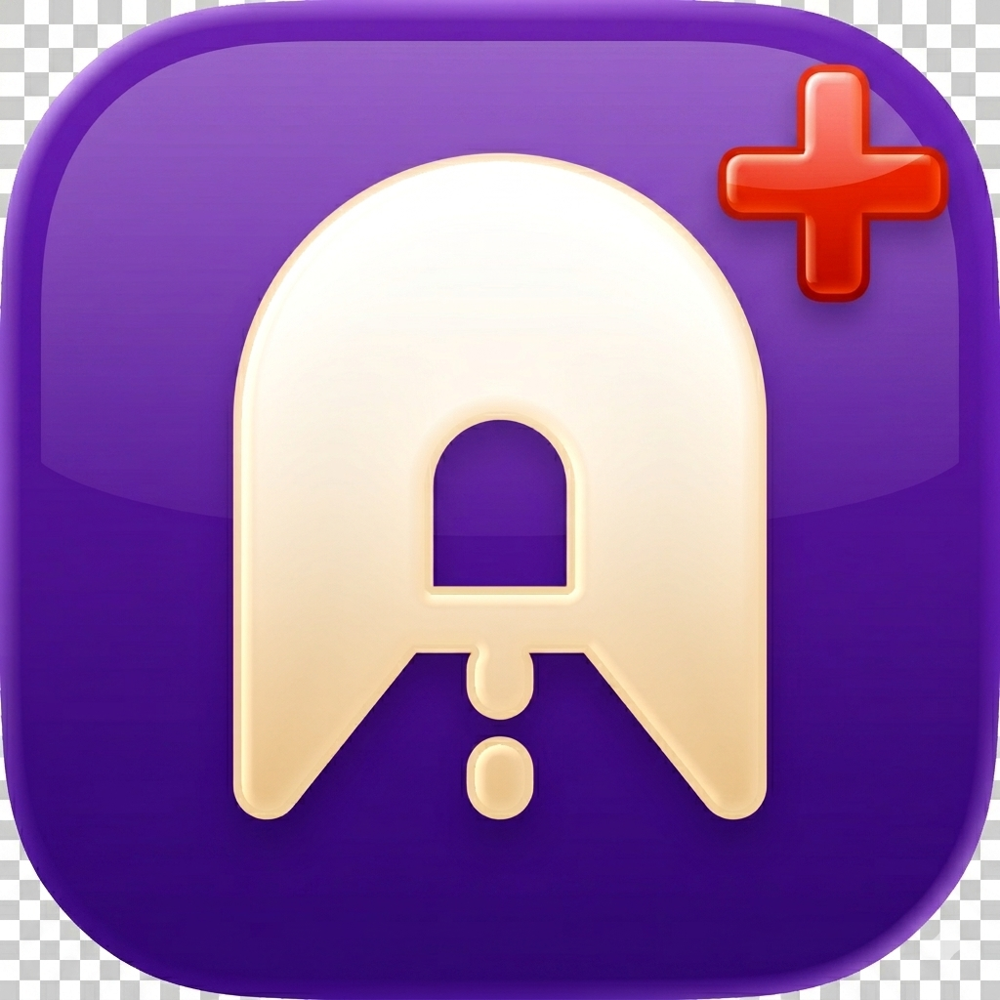
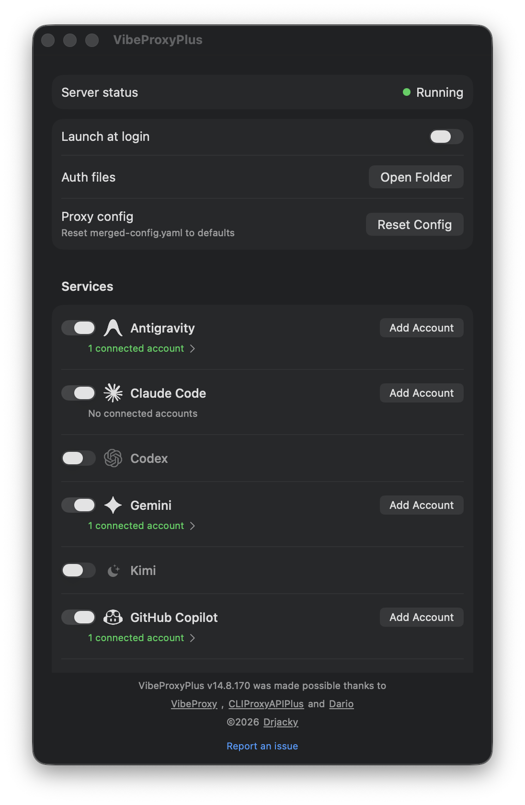

# VibeProxyPlus

<p align="center">
  
</p>

<p align="center">
  <a href="https://github.com/Drjacky/VibeProxyPlus/actions"></a>
  <a href="https://github.com/Drjacky/vibeproxyplus/blob/main/LICENSE"></a>
  <a href="https://github.com/Drjacky/vibeproxyplus"></a>
</p>

Native macOS menu bar app that routes your existing AI subscriptions through a local OpenAI-compatible proxy (`http://localhost:8317`).

**VibeProxyPlus** is built on top of the open-source [VibeProxy](https://github.com/automazeio/vibeproxy) macOS UI and uses [CLIProxyAPIPlus](https://github.com/kaitranntt/CLIProxyAPIPlus), an excellent unified proxy server for AI services with support for third-party providers.

Pre-built apps: **[Releases](https://github.com/Drjacky/vibeproxyplus/releases)**

---

## Supported providers

VibeProxyPlus connects the AI subscriptions you already pay for to a single local endpoint (`http://localhost:8317/v1`). Enable only the providers you need in Settings.

**Built-in providers**

- **Claude Code** (OAuth)
- **Codex / ChatGPT** (OAuth)
- **Gemini** (OAuth)
- **Kimi** (OAuth)
- **Qwen** (OAuth)
- **Antigravity** (OAuth)
- **Z.AI GLM** (API key)
- **GitHub Copilot** (OAuth, when configured)
- **Cursor** (OAuth or local token import from Cursor IDE)
- **Custom providers** (OpenAI-compatible endpoints you define)

**Works with**

Any tool that supports a custom OpenAI-compatible base URL. Point the client at `http://localhost:8317/v1` and use a placeholder API key where required.

<p align="center">
  </a>
</p>

### Setup guides

- [Cursor provider](CURSOR_SETUP.md)
- [Factory CLI](FACTORY_SETUP.md)
- [Amp CLI](AMPCODE_SETUP.md)

---

## Features

- Native SwiftUI menu bar app (macOS 13+)
- One-click server start/stop; credentials in `~/.cli-proxy-api/`
- OAuth for Codex, Claude, Gemini, Kimi, Qwen, Antigravity; API key for Z.AI GLM
- **Cursor:** Add Account (PKCE) or Fetch Auth Locally from Cursor IDE `state.vscdb`
- Multi-account per provider with round-robin and failover
- Provider enable/disable with hot reload
- Vercel AI Gateway option for Claude (see settings)
- Self-contained `.app` (CLI binary, config, assets)

---

## Installation

**Requirements:** macOS 13+ on Apple Silicon (M1/M2/M3/M4). Intel ZIPs may be published but are best-effort.

### Download from GitHub Releases (recommended)

**https://github.com/Drjacky/vibeproxyplus/releases**

> **Signing.** Filenames use `VibeProxyPlus-arm64-unsigned.zip` (ad-hoc) or `VibeProxyPlus-arm64-signed.zip` when Apple signing secrets are configured. Unsigned builds need **right-click → Open** the first time.

1. Download the ZIP for your Mac from the latest release.
2. Extract and move `VibeProxyPlus.app` to **Applications**.
3. **Right-click** the app → **Open** → confirm **Open**.

Verify checksums: `shasum -a 256 -c VibeProxyPlus-arm64-unsigned.zip.sha256`

More detail: [INSTALLATION.md](INSTALLATION.md)

### Build from source

```bash
git clone https://github.com/Drjacky/vibeproxyplus.git
cd vibeproxyplus
make app    # downloads cli-proxy-api-plus automatically
open VibeProxyPlus.app
```

Requires `curl` and `jq` (or run `./scripts/fetch-cliproxy-plus.sh` first).

Regenerate `AppIcon.icns` after editing `icon.png`: `make icon`

---

## Quick start

1. Launch **VibeProxyPlus** and open **Settings** from the menu bar.
2. Enable the providers you need.
3. Authenticate:
   - **Connect** / **Add Account** for OAuth providers
   - **Fetch Auth Locally** or **Add Account** for Cursor ([CURSOR_SETUP.md](CURSOR_SETUP.md))
4. Point your tool at `http://localhost:8317/v1` with any placeholder API key (see provider setup docs).

---

## Development

### Project layout

```
vibeproxyplus/
├── src/
│   ├── Sources/
│   │   ├── CursorTokenImporter.swift
│   │   ├── AppConfig.swift
│   │   └── Resources/cli-proxy-api-plus.version
│   └── Package.swift
├── appcast.xml              # Sparkle feed (arm64); empty until you ship releases
├── scripts/fetch-cliproxy-plus.sh
├── scripts/generate-app-icon.sh
├── create-app-bundle.sh
└── Makefile
```

### Commands

```bash
make icon     # Build AppIcon.icns from icon.png
make app      # Build VibeProxyPlus.app
make run      # Build and open
make install  # Copy to /Applications
make clean
cd src && swift test
```

The ~50MB `cli-proxy-api-plus` binary is **not in git** (fetched at build time). See `scripts/fetch-cliproxy-plus.sh` and `cli-proxy-api-plus.version`.

App version: edit `src/Info.plist` (`CFBundleShortVersionString` and `CFBundleVersion`), or pass `APP_VERSION` when building.

---

## GitHub Releases and CI

| Workflow                                           | When it runs      | What it does                                 |
|----------------------------------------------------|-------------------|----------------------------------------------|
| [Build](.github/workflows/build.yml)               | Push/PR to `main` | Compile + tests only (no release)            |
| [Build and Release](.github/workflows/release.yml) | See below         | Build ZIP/DMG and attach to a GitHub Release |

**Pushing commits to `main` does not create a release.**

### Option A: Draft release on GitHub (recommended)

1. **Releases** → **Draft a new release**
2. Create tag `v10.8.163` (or your version) on the commit you want
3. Leave **Set as a pre-release** off, keep **This is a draft release** checked
4. Click **Save draft** (do not publish yet)
5. **Actions** runs **Build and Release** automatically and uploads ZIP/DMG to that draft
6. Review assets on the draft, then **Publish release** when ready

Use tag names like `v10.8.162` (must start with `v`).

### Option B: Run workflow manually

1. **Actions** → **Build and Release** → **Run workflow**
2. **version:** e.g. `10.8.163` (no `v` prefix)
3. **draft:** `true` to keep a draft on GitHub (default)
4. **publish:** `true` only if `draft` is `false` and you want it live immediately

---


## Credits

- [VibeProxyPlus](https://github.com/automazeio/vibeproxyplus) - original macOS menu bar app
- [kaitranntt/CLIProxyAPIPlus](https://github.com/kaitranntt/CLIProxyAPIPlus) - unified proxy server (Cursor and other providers)

---

## License

MIT - see [LICENSE](LICENSE).

## Support

- **Issues:** https://github.com/Drjacky/vibeproxyplus/issues
- **Repository:** https://github.com/Drjacky/vibeproxyplus
